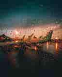

# Quality

Adjust the output quality (compression level) for lossy formats like JPEG and WebP.

## Syntax

| Command   | Argument Format |
|-----------|------------------|
| `quality` | `int` (1–100)     |

## Behavior

- Controls the trade-off between image quality and file size for supported formats (`jpg`, `webp`).
- Has no effect on lossless formats (like `png` or `avif` in lossless mode).
- Higher values produce larger files with better visual fidelity.
- Lower values reduce file size at the cost of detail and sharpness.

### Accepted Range

- `1` — lowest quality, maximum compression
- `100` — best quality, minimal compression
- Default is typically format-specific if not explicitly set

## Example

#### Set JPEG quality to 25:

Original image on the left, quality 25 on the right. Original is 4KB, quality 25 is 1KB.

```
/v5/quality/25/?url=pexels-photo-1539116.jpeg
```


